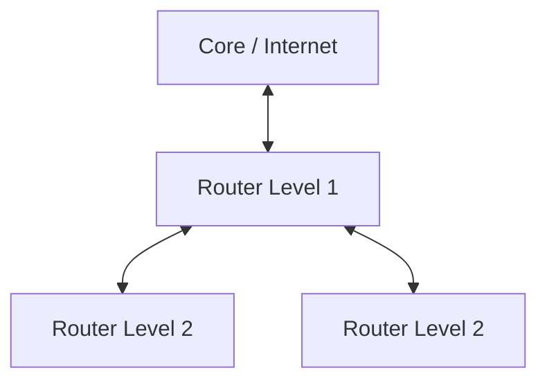

# Switches, Routers & Hierarchical Routing

This module covers the core operation of Layer 2 switches (Learn, Flood, Forward), Layer 3 routers (Routing Tables, Multi-Hop forwarding), and scalable network architecture concepts (Hierarchical Topology & Route Summarization).

---

## Section 1: Layer 2 Switches

A switch facilitates communication **within** a local area network (LAN) by inspecting Layer 2 Ethernet frames. It builds and maintains a **MAC Address Table** mapping ports to physical addresses.

### The Three Core Tasks

When a frame enters a switch port, the switch executes three operations:

1. **Learn:** Inspects the **Source MAC address**. Maps the MAC address to the incoming port in its MAC table.
2. **Flood:** Inspects the **Destination MAC address**. If the destination MAC is missing from the table (or is a Broadcast `FF:FF:FF:FF:FF:FF`), the switch forwards the frame out of **all ports except the incoming port**.
3. **Forward:** If the Destination MAC exists in the table, the switch forwards the frame directly out of the associated target port (Unicast).

> **Note on Multi-Switch Networks:** A single switch port can map to multiple MAC addresses if it connects to a secondary switch or downstream hub.

### Virtual LANs (VLANs)
A **VLAN** logically segments a single physical switch into isolated virtual groups:
* Each VLAN maintains its own isolated **MAC Address Table**.
* Learn, Flood, and Forward operations occur exclusively within the assigned VLAN boundary.

---

## Section 2: Layer 3 Routers

A router connects different networks and routes IP packets across boundaries. Unlike a host, a router **forwards packets not explicitly addressed to itself**.

### The Routing Table
Routers maintain a **Routing Table** to determine where to forward packets based on their destination IP address. Routes are learned in three ways:

* **Directly Connected:** Networks attached directly to the router's local interfaces (learned automatically).
* **Static Routes:** Manually configured paths defined by an administrator.
* **Dynamic Routes:** Automatically calculated paths populated via routing protocols (e.g., OSPF, RIP).

> **Packet Dropping:** If a router receives a packet targeting an unknown network and no **Default Route** exists, the packet is discarded.

---

## Section 3: End-to-End Multi-Hop Packet Lifecycle

When a packet travels from **Host A** (Network 1) to **Host C** (Network 3) through **Routers R1 and R2**: [ Host A ] ===> [ Router R1 ] ===> [ Router R2 ] ===> [ Host C ]

### The Forwarding Rule
> **Fundamental Principle:** The **Destination IP address NEVER changes** end-to-end, but the **Source/Destination MAC addresses CHANGE at every hop**.

### Step-by-Step Flow

#### 1. Host A $\rightarrow$ Router R1
* Host A determines Host C is on a different network and prepares to send data to its **Default Gateway (R1)**.
* **ARP Check:** Host A broadcasts ARP to resolve R1's MAC address.
* **Encapsulation:** 
  * `Layer 3:` Source IP = `Host A` | Destination IP = `Host C`
  * `Layer 2:` Source MAC = `Host A` | Destination MAC = `R1`

#### 2. Router R1 $\rightarrow$ Router R2
* R1 receives the frame, **strips the L2 header**, and inspects the L3 Destination IP (Host C).
* R1 consults its Routing Table $\rightarrow$ Next Hop is **R2**.
* **ARP Check:** R1 resolves R2's MAC address via ARP if not cached.
* **Re-Encapsulation:**
  * `Layer 3:` Source IP = `Host A` | Destination IP = `Host C` *(Unchanged)*
  * `Layer 2:` Source MAC = `R1` | Destination MAC = `R2` *(Updated)*

#### 3. Router R2 $\rightarrow$ Host C
* R2 receives the frame, **strips the L2 header**, and inspects the L3 Destination IP.
* R2 sees Host C's network is **Directly Connected**.
* **ARP Check:** R2 resolves Host C's MAC address via ARP.
* **Re-Encapsulation:**
  * `Layer 3:` Source IP = `Host A` | Destination IP = `Host C` *(Unchanged)*
  * `Layer 2:` Source MAC = `R2` | Destination MAC = `Host C` *(Updated)*
* **Delivery:** Host C receives the frame, strips L2 & L3 headers, and processes the payload.

> **Return Path (Host C $\rightarrow$ Host A):** Follows the exact reverse process. Because ARP caches are now populated across all devices, return traffic transmits significantly faster without broadcast delays.

---

## Section 4: Network Architecture & Route Summarization

### Hierarchical Design vs. Linear Daisy-Chaining
Connecting routers in a **hierarchical tree structure** (Core $\rightarrow$ Distribution $\rightarrow$ Access) is preferred over linear daisy-chaining:
* **Equal Hop Count:** Ensures consistent bandwidth and uniform hop distances across leaf nodes.
* **Redundancy:** Facilitates backup paths in case an upstream link fails.

### Route Summarization (CIDR Aggregation)
Route summarization consolidates multiple subnets into a single prefix entry, drastically reducing routing table sizes and lookup overhead.

* **Without Summarization:**
  * `10.20.55.0/24` $\rightarrow$ Next Hop: R4
  * `10.20.66.0/24` $\rightarrow$ Next Hop: R4
  * `10.20.77.0/24` $\rightarrow$ Next Hop: R4
* **With Summarization:**
  * `10.20.0.0/16` $\rightarrow$ Next Hop: R4 *(Matches any destination IP starting with 10.20.x.x)*

### The Default Route (`/0`)
* **Subnet Mask `/0`** matches **0 bits**, meaning it matches **all destination addresses**.
* Functions as a catch-all route (*"For any unmatched destinations, forward here"*), typically pointing out toward the Internet Gateway.
